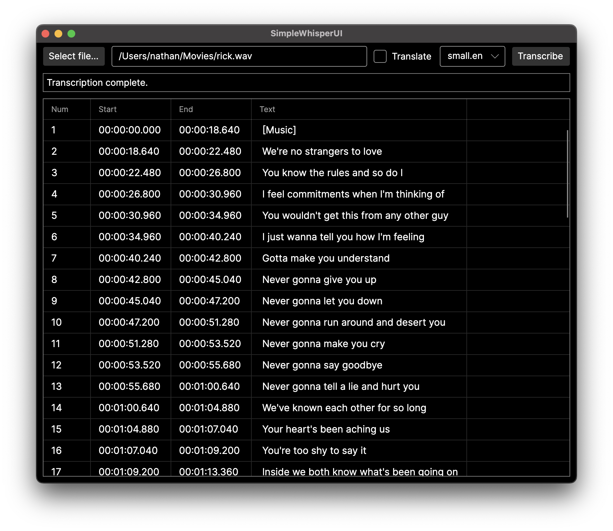

# whisper.net-tests
Test CLI and GUI applications using Whisper.net

## SimpleWhisperUI

A simple Avalonia UI application that uses Whisper.net to transcribe audio from an input file.

If the file is not a wav, it will use FFMpegCore to convert it, so long as FFmpeg is available in the PATH.

